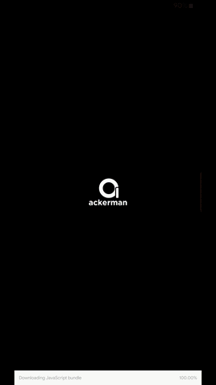

The anime repository for your smartphone 

 

## What is Ackerman?

Ackerman is a mobile app for looking up new and upcoming Anime online. It uses the Anilist.co GraphQL API. <b>This project is purely for education purposes with no copyright infringement intended. </b> The app hosts no copyrighted material and the content of the application is hosted elsewhere unrelated to this project or any of its contributors

An earlier version of this app is available as a release.

A preview of this application build is below.

<h5 align="center" >🚧 WORK IN PROGRESS 🚧</h5>

_The video is a bit choppy (compressed from 50 MB down to 300KB), please clone this repo and build the application for the actual user experience_

## Releases

The app has been tested on Android 9 (_Android Pie_) and above, but should work on recent android versions.

The releases for the application can be found [here](https://github.com/Uzair-Fasih/Ackerman/releases).

<b>_This page is being updated. Please try looking here later_</b>
