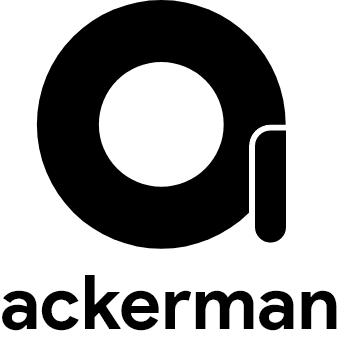

The anime repository for your smartphone 

## What is Ackerman?
Ackerman is a mobile app that is essentially a wrapper for the HorribleSubs website. It internally scrapes data form the HorribleSubs website and also make calls to their internal API. <b>This project is purely for education purposes with no intent on copyright infringement intended. </b> The app hosts no copyrighted material and the content of the application is hosted elsewhere unrelated to this project or any of its contributors

## Releases
The app has been tested on Android 9 (*Android Pie*) and above, but should work on recent android versions

For releases please visit the releases page